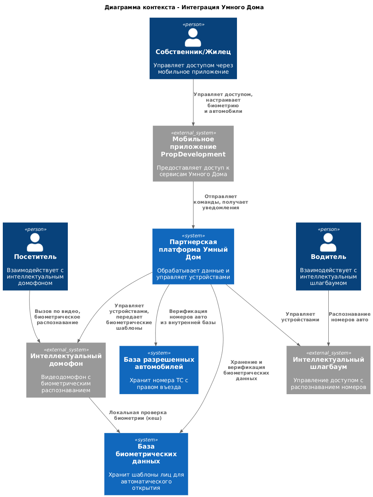
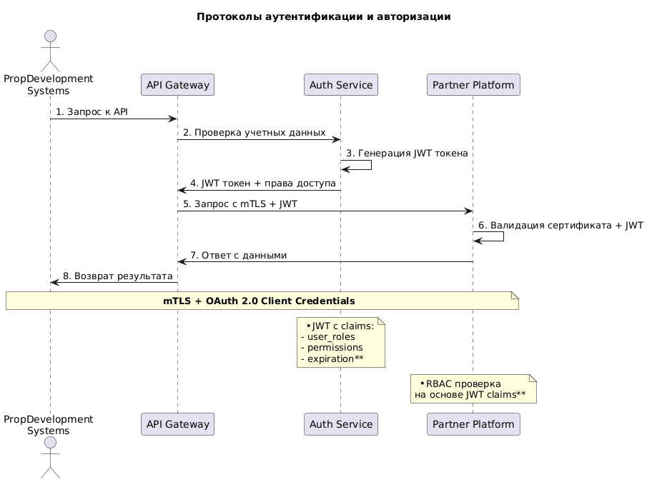
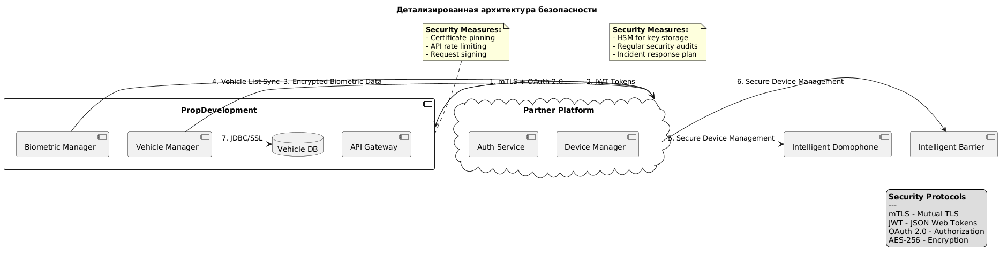

## Диаграмма контекста 

## Диаграмма контейнеров

## Требования к внешним интеграциям

Требования к безопасности

| Аспект| Требование | 
|---|--------|
|Аутентификация |	Mutual TLS (mTLS) для идентификации сторон. OAuth 2.0 Client Credentials Flow для авторизации сервис-сервис взаимодействия.|
|Авторизация	|RBAC на стороне партнера. JWT токены с claims (роли, разрешения) для каждого вызова.|
|Шифрование	|TLS 1.3 для всех каналов связи. Шифрование данных при хранении (AES-256).|
|Данные	|Биометрические данные передаются только в зашифрованном виде. Номера авто хранятся в внутренней БД с ограниченным доступом.|
|Сертификация|	Партнер должен иметь сертификаты соответствия ФЗ-152 для обработки ПДн.|
|Аудит|	Логирование всех операций с биометрическими данными и доступом к автомобилям.|

### Протоколы аутентификации и авторизации

### Организация взаимодействия между системами

[PropDevelopment Systems] → [API Gateway] → [Smart Home Facade] → [Партнерская платформа]

### Протоколы и форматы:

__REST API__   - для синхронных команд (управление доступом, настройки)

__WebSocket__   - для реального времени (уведомления, события доступа)

__Apache Kafka__ - для асинхронной синхронизации данных

__Формат данных:__ JSON с обязательной JSON Schema валидацией\

#### Специфические требования к интеграциям:\

#### 1.Для интеллектуального домофона:

Максимальная задержка от вызова до уведомления: < 3 секунд

Протокол передачи видео: H.265 

Поддержка offline-режима: кеширование биометрических шаблонов на устройстве

#### 2.Для интеллектуального шлагбаума:

Задержка распознавания номера до открытия: < 2 секунды

Резервный режим работы по RFID-картам

#### 3.Для базы автомобилей:

Синхронизация данных каждые 5 минут

Веб-интерфейс для управления белыми списками

API для массового импорта/экспорта номеров

#### 4.Операционные требования:

SLA доступности API партнера: 99.95%

Мониторинг здоровья интеграций с двух сторон

Ежегодные пентесты интеграционных компонентов

Логирование всех событий доступа с retention 1 год

#### 5.Требования к данным:

Биометрические шаблоны: размер < 2 КБ, шифрование AES-256

Номера автомобилей: нормализация формата, валидация

Очистка временных данных каждые 24 часа

### Детализированная схема безопасности
\

